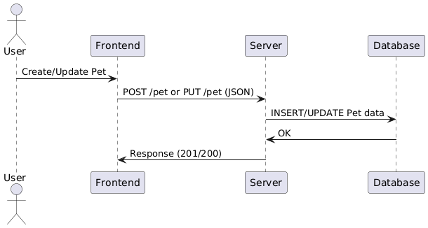

# Petstore
This is a pet store demo using react, pòstgress and nodejs.
## Step-by-step guide: how to create and update a pet on the petstore
### 1. UML Diagrams
The pets updates and creations flow will integrate as shown below:

#### Sequence diagram
   
#### Class diagram
   

### 2. Quick Api description to update and to create a pet
- **Endpoint to create a Pet (POST/pet)**  
  
  This creates a new pet on the Database.  

  **Expected JSON**:
  ```json
  {
    "category": { "id": 1, "name": "Dogs" },
    "name": "Buddy",
    "photoUrls": ["url1.jpg", "url2.png"],
    "status": "available"
  }
  ```

- **Endpoint to update a Pet (Put/pet)**

  This updates an existing pet.

  **Expected JSON**:
  ```json
  {
  "id": 101,
  "name": "BuddyUpdated",
  "status": "pending",
  "photoUrls": ["url1.jpg", "url2.png"] 
  }
  ```

### 3. Set up your Database
**Creation of the pets table**:
```sql
CREATE TABLE IF NOT EXISTS pet (
  id SERIAL PRIMARY KEY,
  category_id INT REFERENCES category(id),
  name VARCHAR(100) NOT NULL,
  status VARCHAR(50),
  photoUrls TEXT[]
);
```
### 4. Set up your Front-end
Below are the core service functions used to interact with our pet store endpoints:

**Create pet**
```javascript

const createPet = async (petData) => {
  const response = await fetch(`${API_URL}/pet`, {
    method: 'POST',
    headers: {
      'Content-Type': 'application/json',
      Authorization: `Bearer ${token}`
    },
    body: JSON.stringify(petData)
  });
  if (!response.ok) throw new Error('Failed to create pet');
  return await response.json();
};
```
**Update a pet**
```javascript
const updatePet = async (petData) => {
  const response = await fetch(`${API_URL}/pet`, {
    method: 'PUT',
    headers: {
      'Content-Type': 'application/json',
      Authorization: `Bearer ${token}`
    },
    body: JSON.stringify(petData)
  });
  if (!response.ok) throw new Error('Failed to update pet');
  return await response.json();
};
```

### 5. Set up your Back-end
The back end is responsible for receiving the token obtained from your front end.
When the use submits the form, your front end sends a token to an endpoint that specified preciously.
- **The POST/pet endpoint is designed to create new pets in the system.**
  
  ```javascript
  createPet: async (req, res) => {
      try {
        const { category, name, photoUrls, tags, status } = req.body;
        let categoryId = null;

        if (category && category.id) {
          categoryId = category.id;
        }

        const insertQuery = `
          INSERT INTO pet (category_id, name, status, photoUrls)
          VALUES ($1, $2, $3, $4)
          RETURNING *;
        `;
        const values = [categoryId, name, status, photoUrls];
        const result = await pool.query(insertQuery, values);
        const newPet = result.rows[0];

        return res.status(201).json(newPet);
      } catch (error) {
        console.error('Error creating pet:', error);
        return res.status(500).json({ message: 'Internal Server Error' });
      }
    }
    ```
  -**Example use with curl**
  ```
  curl -X POST http://localhost:3001/pet \
  -H "Content-Type: application/json" \
  -d '{
      "category": {
          "id": 1,
          "name": "Dogs"
      },
      "name": "Buddy",
      "photoUrls": ["buddy1.jpg", "buddy2.png"],
      "status": "available"
  }'
- **The PUT/pet endpoint allows updating existing pets information.**
  ```javascript
  updatePet: async (req, res) => {
    try {
      const { id, category, name, status, photoUrls } = req.body;
      
      const checkPet = await pool.query('SELECT * FROM pet WHERE id = $1', [id]);
      if (checkPet.rowCount === 0) {
        return res.status(404).json({ message: 'Pet not found' });
      }

      let categoryId = null;
      if (category && category.id) {
        categoryId = category.id;
      }

      const updateQuery = `
        UPDATE pet
        SET category_id = $1, name = $2, status = $3, photoUrls = $4
        WHERE id = $5
        RETURNING *;
      `;
      const values = [categoryId, name, status, photoUrls, id];
      const result = await pool.query(updateQuery, values);

      return res.status(200).json(result.rows[0]);
    } catch (error) {
      console.error('Error updating pet:', error);
      return res.status(500).json({ message: 'Internal Server Error' });
    }
  }
  ```

- **Example use with curl**
  ```
    curl -X PUT http://localhost:3001/pet \
  -H "Content-Type: application/json" \
  -d '{
      "id": 1,
      "name": "BuddyUpdated",
      "status": "pending",
      "photoUrls": ["url1.jpg", "url2.png"]
  }'
  ```
